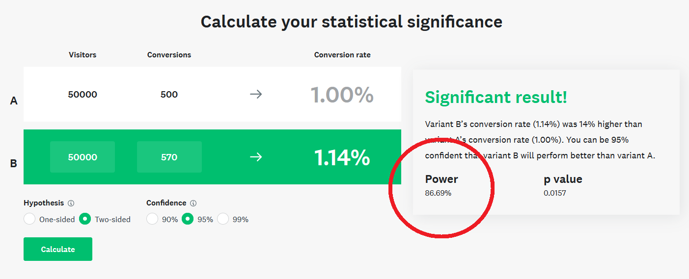
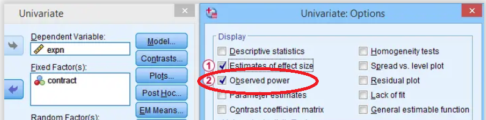

## Introduction

[Download the R Markdown notebook here](https://github.com/JB-Statistical-Consulting/biostatistics/tree/main/biostatistics.ca/abuse_of_power) used to generate this blog post and practice your R skills for free!
```{r setup, echo = FALSE, warning=FALSE}
knitr::opts_chunk$set(echo = TRUE, warning = FALSE, message = FALSE)
path <- "C:/Users/justi/Documents/Github/biostatistics/biostatistics.ca/abuse_of_power"
setwd(path)

library(ggplot2)
library(pagedown)
```

Some widely used statistical tools, e.g. the AB testing significance calculator from Survey Monkey or even respectable (?) software like SPSS, provide a value of observed (or post-hoc) power computed from the data - see images below.

```{r survey monkey, echo = FALSE, fig.show = 'hold', out.width = "25%", out.height = "25%", fig.align = "center"}

```
<center>
{width=440px} {width=440px}
</center>

\newline 
A company like Survey Monkey may be forgiven for making statistical mistakes...But SPSS, you should know better!

<p style="border-width:3px; border-style:solid; border-color:#ff5555; padding: 1em;"> **THIS IS NOT ONLY COMPLETELY USELESS, BUT DOWNRIGHT DANGEROUS, AS IT STRONGLY ENCOURAGES FALLACIOUS STATISTICAL LOGIC !** </p>

Let's dig into this.

Disclaimer : there will be some mathematical symbols and code, but they are not essential to the message; hopefully they will help though!

\newpage

### A refresher on hypothesis testing

We must first recall the basics of **hypothesis testing**. 

Examples: 

- We run an AB test and want to know if the A channel converted at a higher rate than the B channel.
- We test a treatment vs. a placebo and want to know if the treatment improves a health outcome, e.g. reduces blood-pressure.

We are interested in $\mu_A$ and $\mu_B$, the means of our groups. We do the following hypothesis test:
\[\cases{H_0 : \mu_A = \mu_B, \text{ both groups have the same mean}\\
H_1 : \mu_A \neq \mu_B, \text{ means are different.}}\]

We collect data (using sound methodology, which is way harder than it seems) and want to *reject the null hypothesis* $H_0$.

<p style="border-width:3px; border-style:solid; border-color:#50fa7b; padding: 1em;"> **Goal of hypothesis testing: **We want our data to convince us that we can comfortably affirm that the means are **not** equal in both groups, using some statistical test, often the *two-sample t-test* (see below).</p>

\newpage

## Ok, but what is power?

Power is the **probability of rejecting the null hypothesis when it is *false***
\[\mathbb{P}(\text{reject } H_0|H_0 \text{ is false}).\]

This measures how *sensitive* the statistical test is to deviations from the null hypothesis. 
Let's call $\delta := \mu_A - \mu_B$, the difference in the means. 

If $H_0$ is false, then $\delta \neq 0.$ 
There is an immediate difficulty : $H_0$ can be false in infinite ways!

- $\delta$ can be minuscule;
- $\delta$ can be huge;
- in fact, $\delta$ can be any non-zero number!

This means that the power of the test depends on the difference of the means...but if we knew the difference of the means, we wouldn't need statistics... what gives?

\newpage

### Power
    
Power depends on:

1. How large the true difference $\delta$ is
    + A larger difference is easier to detect.
2. How uncertain is our estimate of this difference
    + A less variable estimate (i.e. smaller variances $\sigma_A^2, \sigma_B^2$ for groups $A$ and $B$, respectively) gives us more confidence
3. How much data (i.e. $n_A, n_B$ data points for group $A$ and $B$, respectively) is available in each group to run the test.
    + More data gives us more confidence.
    
Mathematically, we write 
\[\mathbb{P}(\text{reject } H_0|H_0 \text{ is false}) = f(\delta, \sigma^2, n),\]

where $f$ is some function that depends on the test. 

In practice, we summarize all this in an *effect-size* (there are many ways to do this).

\newpage

### Power analysis, the right and wrong ways

:::: {style="display: flex;"}
::: {}

<p style="border-width:3px; border-style:solid; border-color:#50fa7b; padding: 1em;">
 **Correct power analysis** is used **BEFORE running the experiment** to *determine the sample-size needed* in about the following manner:</p>


1. We use an estimate of *effect size* from the literature
    + Or we use a Minimum Significant Difference (MSD), that is the smallest *effect size* that is worth the trouble
2. We fix levels of power and significance (conventionally, $80\%$ and $5\%$, respectively).
3. We use some math (or software) to calculate the sample-size required to adequately power our test.


:::


::: {}

:::

::: {}
<p style="border-width:3px; border-style:solid; border-color:#ff5555; padding: 1em;">

**Post-hoc** power proceeds INCORRECTLY as follows, **using the data collected from the experiment**:</p> 

1. Computes the effect-size measured in the experiment.
2. Computes the power associated with this effect-size.

But, as we will see, this is worthless, considering we always ALSO calculate a *p-value* (we will not dive into the p-value rabbit hole, lest we never come back).

:::
::::

\newpage

## Example of Power Calculation for Two-Sample t-test

We run an AB test, or a Randomized Controlled Trial, and are now ready to perform the *two-sample t-test*, which uses the *t-statistic* \[t = \frac{\bar{x}_A - \bar{x}_B}{s},\]
where 

- $\bar{x}_A$ is the mean computed in the first group,
- $\bar{x}_B$ is the mean computed in the second group, and
- $s$ is a standard deviation estimate (the estimation approach can vary depending on different assumptions; it's a nuanced discussion for another time.)

We will run a simulation of this scenario, where we know the ground-truth, showing along the way why computing observed power makes no sense!

\newpage

### Simulation Parameters 

<p style="border-width:3px; border-style:solid; border-color:#f8f8f2; padding: 1em;">
*You can safely skip these sections and head directly to the plots if you're not familiar with code or technical probability and statistics stuff.*
</p>

We fix identical parameters for the two groups: there are no differences to detect with the test.

- $x_A \sim \mathcal{N}(\mu_A, sd_A),\quad  x_B \sim \mathcal{N}(\mu_B, sd_B)$,
where
  - $\mu_A = \mu_B = 0$
  - $s_A = s_B = 1$
  - $n_A = n_B = 20$

```{r parameters}
set.seed(1) #for reproducibility
n_sim <- 10000 #We will simulate a large number of experiments
#normal variate simulation parameters
n_A <- 20  #group A
n_B <- 20 #group B
mu_A <- 0 #group A's real mean we are trying to estimate
mu_B <- 0 #group B' real mean we are trying to estimate
sd_A <- 1 #group A's standard deviation
sd_B <- 1 #group B's standard deviation
```
\newpage

### Simulation 

```{r simulation}
#t-test critical value, we will reject H_0 when the absolute value of the t-statistic exceeds this threshold
crit <- qt(0.975, n_A + n_B -2) 

#simulation
significant <- c()
t.stat <- c()

for (simulation in 1:n_sim){
  x_A <- rnorm(n_A, mu_A, sd_A) #we simulate our group A
  x_B <- rnorm(n_B, mu_B, sd_B) #we simulate our group B
  diff.means <- mean(x_A) - mean(x_B) #we estimate  the difference in means
  # print(diff.means)
  s <- sqrt((var(x_A)/n_A + var(x_B)/n_B)) #we estimate s
  
  t.stat[simulation] <- diff.means/s #we compute the t-statistic
  significant[simulation] <- abs(t.stat[simulation]) >= crit #we check if the test is significant
}
```

\newpage

### Simulation Results

From our 10000 simulations, there is no difference to detect between our groups. We therefore expect about $5\%$ of them to be significant, by definition of testing at the $5\%$ level.

```{r alpha, echo=FALSE}
print(paste(round(sum(significant) / n_sim, 4)*100, "% of simulations are significant, when the null hypothesis is true.")) 
```
```{r cohen_d hist, echo = FALSE, out.width = "65%", out.height = "65%", fig.align = "center"}
knitr::opts_chunk$set(warning = FALSE, message = FALSE) 

t.stat.hist <- ggplot(data.frame(t.stat, significant), aes(x=t.stat, fill = factor(1-significant))) +
  geom_histogram(bins=100) +
  theme(legend.position = "none") +
  geom_vline(xintercept = crit, alpha = 1/2, color = "#F8766D") +
  geom_vline(xintercept = -crit, alpha = 1/2, color = "#F8766D") +
  annotate("label", x = -4, y = 20, color = "#F8766D", alpha = 1/3, label = "significant") +
  annotate("label", x = 4, y = 20, color = "#F8766D", alpha = 1/3, label = "significant") +
  xlim(c(-5,5))

t.stat.hist
```

```{r effect size, echo = FALSE, out.width = "50%", out.height = "50%", fig.align = "center"}
#visualize results
results <- data.frame(
  t.stat = abs(t.stat), 
  p.value = 1-pt(abs(t.stat),n_A + n_B -2))

#gives the quantile function of 
#the n-1 df Student distribution
effect_size_plot <- results |>
  ggplot(aes(x = t.stat, y = p.value)) +
  geom_point(alpha = 0.1) +
  ggtitle("Nonsignificant Results Are Those With Lower Estimated Effect Sizes... \n and the relationship is 1 to 1!")
```

\newpage

### Power and P-Values

Observed power is then computed for every simulation by using the estimated t-statistics.

```{r power}
#what about power?
observed.power <- 1-pt(crit,n_A + n_B - 2, ncp=abs(t.stat))
```


```{r power plot creation, echo = FALSE}
results$observed.power <- observed.power

power.plot <- results |>
  ggplot(aes(x = observed.power, y = p.value, color = factor(p.value > 0.05))) +
  geom_point(size= 0.25, alpha = 1/3) +
  geom_hline(yintercept = 0.05, alpha = 1/2, color = "#F8766D") +
  annotate("label", x = 0.12, y = 0.07, color = "#00BFC4", alpha = 1/4, label = "non-significant") +
  annotate("label", x = 0.12, y = 0.03, color = "#F8766D", alpha = 1/4, label = "significant") +
  theme(legend.position = "none") +
  ggtitle("Nonsignificant Results Are Those With Lower Power... \nand the relationship is 1 to 1!")
```

```{r power plot, echo = FALSE, out.width = "65%", out.height = "65%", fig.align = "center"}
power.plot
```

\newpage

## The Takeaways

1. Observed power and p-value are in a 1-to-1 relationship: observed power adds no new information. 
    + If we have a low p-value, we have high power.
    + If we have a high p-value, we have low power. 
2. By definition, tests with low-observed power will be those for which we have not rejected $H_0$.
    + Using observed power when our test is not significant is simply wrong.
    + Power should be computed BEFORE any data analysis, not after. 
3. Tools like SPSS and Survey Monkey reporting observed power tempts users to interpret non-significant tests with "high" power as evidence for the null hypothesis.
    + But we simply cannot make this logically fallacious claim.

In Sander Greenland's 2012 paper *Nonsignificance Plus High Power Does Not Imply Support For the Null Over the Alternative*, he reports being "asked to review pooled data from randomized trials as used in a U.S. Food and Drug Administration (FDA) alert and report" where a "defense expert statistician (a full professor of biostatistics at a major university and ASA Fellow)" made this logical mistake!
    
**No one is immune from statistical error, so spread the word and be vigilant :)**

## Some References

- Daniel Lakens has a [great blog post](https://daniellakens.blogspot.com/2014/12/observed-power-and-what-to-do-if-your.html) about this.
- If you want to learn how to use power correctly to calculate required sample sizes, I recommend [this book](https://www.amazon.ca/Design-Analysis-Experiments-Douglas-Montgomery/dp/1118146921) by Douglas Montgomery. I will eventually write more about this, but in the meantime don't hesitate to [reach out](www.justinbelair.ca) by filling out a contact form or by [Linkedin DM](https://www.linkedin.com/in/justinbelair/) if you need help with this.
