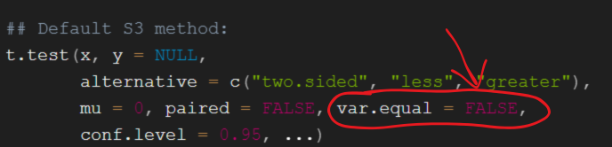

```{r setup, include=FALSE}
knitr::opts_chunk$set(echo = TRUE, class.source = "rcode", class.output = "rcode")
setwd(dirname(rstudioapi::getActiveDocumentContext()$path))
```

Get accces to our [free Github Notebook Library](https://www.biostatistics.ca/github-library/?utm_source=biostatistics&utm_medium=welch_t_test) to download this code notebook and try for yourself!


Welch's correction is used to account for unequal variances when we test equality of means in two samples via the t-test.

R uses this as a default when we use the function t.test from R's default stats package, see for yourself below!

<center>
{width=440px}
</center>

Now, let's try it out :)

\newpage

## A small data simulation - Equal variance

We will start out by simulating data from normal distributions with exactly the same parameters.

- The means are equal so we don't expect tests to be significant, except for about 5% of simulations (i.e. false positives)
- The standard deviations, and therefore the variances, are equal. So in theory, Welch's correction is not necessary.
```{r, class.source="rcode"}
set.seed(1) #for reproducibility

n_sim <- 10000 #We will simulate a large number of experiments

n_A <- 30  #group A
n_B <- 20 #group B

mu_A <- 0 #group A's real mean we are trying to estimate
mu_B <- 0 #group B's real mean we are trying to estimate

sd_A <- 1 #group A's standard deviation
sd_B <- 1 #group B's standard deviation
```

\newpage

### Equal variance results

We simulate 10000 small experiments of this kind, and compare the proportion of simulations where we (falsely) declare significance, in both the Welch corrected and uncorrected versions, both very close to 5%.

```{r, class.source="rcode"}
p.value.welch <- c()
p.value.equal.var <- c()

for (sim in 1:n_sim){
  x_A <- rnorm(n_A, mu_A, sd_A) #we simulate our group A
  x_B <- rnorm(n_B, mu_B, sd_B) #we simulate our group B
  
  p.value.welch[sim] <- t.test(x_A, x_B)$p.value
  p.value.equal.var[sim] <- t.test(x_A, x_B, var.equal = TRUE)$p.value
}
```


```{r, echo = FALSE, class.source="rcode"}
paste(mean(p.value.welch <= 0.05)*100, "% of simulations were (falsely) declared significant with Welch's t-test")  #Proportion of significant tests with Welch's correction
paste(mean(p.value.equal.var <= 0.05)*100, "% of simulations were (falsely) declared significant with standard equal variance t-test") #Proportion of significant tests when we assume equal variance
```

\newpage

## A small data simulation - Unequal variance

Now, we make the standard deviation of group A thrice as much, so the variance $3^2 = 9$ times as much.

- Again, the means are equal so we don't expect tests to be significant, except for about 5% of simulations (i.e. false positives)

```{r, class.source="rcode"}
sd_A <- 3 #group A's standard deviation
sd_B <- 1 #group B's standard deviation
```

\newpage

### Unequal variance results

With the same simulation (with hidden code) using the new unequal variances data parameters, we see that the uncorrected version of the t-test is (falsely) deviating from the 5% nominal level of significance we are aiming for.

```{r, class.source="rcode", echo = FALSE}
p.value.welch <- c()
p.value.equal.var <- c()

for (sim in 1:n_sim){
  x_A <- rnorm(n_A, mu_A, sd_A) #we simulate our group A
  x_B <- rnorm(n_B, mu_B, sd_B) #we simulate our group B
  
  p.value.welch[sim] <- t.test(x_A, x_B)$p.value
  p.value.equal.var[sim] <- t.test(x_A, x_B, var.equal = TRUE)$p.value
}

```

```{r, echo = FALSE, class.source="rcode"}
paste(mean(p.value.welch <= 0.05)*100, "% of simulations were (falsely) declared significant with Welch's t-test")  #Proportion of significant tests with Welch's correction
paste(mean(p.value.equal.var <= 0.05)*100, "% of simulations were (falsely) declared significant with standard equal variance t-test") #Proportion of significant tests when we assume equal variance
```

\newpage

## A small data simulation - Extremly unequal variances

Let's make the standard deviation of group A extremely unequal, ten times as much, so the variance $10^2 = 100$ times as much.

```{r, class.source="rcode"}
sd_A <- 10 #group A's standard deviation
sd_B <- 1 #group B's standard deviation
```

### Extremly unequal variances results

Again, we run the same simulation. Again, the uncorrected t-test which is way off. 

```{r, class.source="rcode", echo = FALSE}
p.value.welch <- c()
p.value.equal.var <- c()

for (sim in 1:n_sim){
  x_A <- rnorm(n_A, mu_A, sd_A) #we simulate our group A
  x_B <- rnorm(n_B, mu_B, sd_B) #we simulate our group B
  
  p.value.welch[sim] <- t.test(x_A, x_B)$p.value
  p.value.equal.var[sim] <- t.test(x_A, x_B, var.equal = TRUE)$p.value
}

```

```{r, echo = FALSE, class.source="rcode"}
paste(mean(p.value.welch <= 0.05)*100, "% of simulations were (falsely) declared significant with Welch's t-test")  #Proportion of significant tests with Welch's correction
paste(mean(p.value.equal.var <= 0.05)*100, "% of simulations were (falsely) declared significant with standard equal variance t-test") #Proportion of significant tests when we assume equal variance
```

\newpage

## Takeaways

Welch's correction works fine when variances are equal (with an ever so-slight reduction in power), but will work way better than the uncorrected t-test when variances are unequal, a much more likely scenario.

- We should always use this, and that's what R does as a default :)
- In SPSS, the t-test output will provide both, along with Levene's test for equality of variances.
  - I personally advise to never test assumptions using hypothesis testing (like Levene's test) and decide on the type of analysis based on significance of results.
    - This is a deep discussion, not without controversy, best saved for another time.
    - This is not the first time I criticize the way SPSS presents results (see my post The Abuse of Power).
- GraphPad Prism provides both test options, and advises (IMO, correctly) to NOT use Levene's test for unequal variances.
  - It cites appropriate literature on why you should use Welch's correction as a default.
- SAS provides both results, with the Welch correction called Satterwaite (the method is sometimes referred to using as Satterwaite-Welch degrees of freedom).

## Learn More

If you want to learn more, join my [free monthly newsletter](https://causal-inference-in-statistics.beehiiv.com/?utm_source=biostatistics&utm_medium=welch_t_test) where I share tips, tricks, and resources for learning statistics and Causal Inference.

## References

- Extensive simulations on the appropriateness of Welch's t-test were done in this paper : [Delacre, Lakens & Leys, Why Psychologists Should by Default Use Welch's t-test Instead of Student's t-test, 2017](https://doi.org/10.5334/irsp.82)